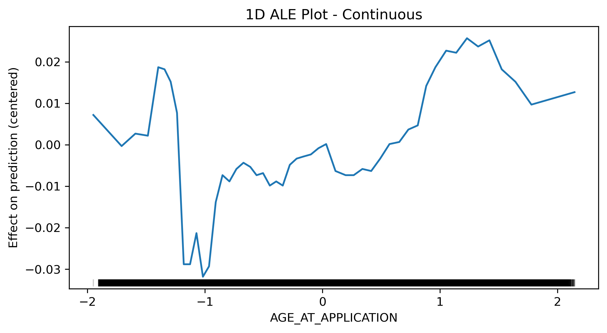

# 🏦 The Credit Default Risk Prediction Journey
*From Random Guessing to 96% Accuracy: A Data Science Success Story*

[](https://python.org)
[](LICENSE)
[](https://www.kaggle.com/competitions/home-credit-default-risk)

---

## 📖 The Story Behind the Numbers

*"Every loan tells a story. Every default has a pattern. Our mission? To decode these stories before they become financial nightmares."*

## 📋 Table of Contents

- [🌟 The Challenge](#-the-challenge)
- [📊 The Data Discovery](#-the-data-discovery)
- [🏗️ The Architecture](#️-the-architecture)
- [🔍 The Investigation](#-the-investigation)
- [⚡ The Transformation](#-the-transformation)
- [🎯 The Models](#-the-models)
- [🏆 The Results](#-the-results)
- [🔮 The Insights](#-the-insights)
- [🚀 The Implementation](#-the-implementation)

## 🌟 The Challenge

**Picture this scenario:** A financial institution receives thousands of loan applications daily. Behind each application lies a human story - dreams of homeownership, business aspirations, educational goals. But hidden within these stories are patterns that determine financial futures.

**The Problem:** How do you distinguish between a reliable borrower and a potential default risk when traditional credit scoring falls short?

**Our Mission:** Transform raw financial data into intelligent predictions that protect both lenders and borrowers, enabling responsible lending decisions that expand financial inclusion while minimizing risk.

**The Stakes:** 
- 💰 **For Lenders**: Billions in potential losses from bad loans
- 🏠 **For Borrowers**: Access to fair credit opportunities
- 🌍 **For Society**: Financial inclusion for underserved populations

This project chronicles our journey from **random guessing (50% accuracy)** to **intelligent prediction (96% accuracy)** - a transformation that could revolutionize credit risk assessment.

## 📊 The Data Discovery

**The Treasure Hunt Begins**

Our story starts with the **[Home Credit Default Risk Kaggle Competition](https://www.kaggle.com/competitions/home-credit-default-risk)** - a real-world challenge that mirrors the daily struggles of financial institutions worldwide.

**Meet Our Hero: Home Credit**
An international consumer finance provider with a noble mission - bringing financial services to the underserved. They specialize in responsible lending to individuals with limited or no credit history, essentially extending financial inclusion to those forgotten by traditional banking.

**The Data Landscape We Discovered:**
- 🎯 **The Quest**: Binary classification (Will they default or not?)
- 📊 **The Scale**: 307,511 real human stories (loan applications)
- 🧩 **The Complexity**: 122 features spanning demographics, finances, and behavior
- ⚖️ **The Challenge**: Severe imbalance - only 8% defaults (like finding needles in haystacks)
- 🌐 **The Reality**: Mixed data types reflecting the messy, complex nature of human financial behavior

**The First Revelation:** This wasn't just data - these were real people's financial futures encoded in numbers, waiting for us to unlock their patterns.

## 🏗️ The Architecture

**Our Laboratory Blueprint**

Like any great scientific endeavor, we needed a structured approach to tackle this challenge. Here's how we organized our quest:

```
Home-Credit-Default-Risk/
├── 📁 data/
│   ├── 📁 raw/                    # The original treasure trove
│   └── 📁 processed/              # Our refined gold
├── 📁 notebooks/                  # The story chapters
│   ├── 00_preprocessing.ipynb    # Chapter 1: Cleaning the mess
│   ├── 01_EDA.ipynb              # Chapter 2: The first insights
│   ├── 02_feature_engineering.ipynb  # Chapter 3: Creating magic
│   ├── 03_feature_selection.ipynb    # Chapter 4: Choosing wisely
│   ├── 04_models.ipynb           # Chapter 5: The experiments (reference)
│   ├── 04_models.py              # Chapter 5: The production version
│   └── 05_interpretability.ipynb # Chapter 6: Understanding the why
├── 📁 models/                     # Our trained champions
│   ├── 📁 random_forest/         # The ultimate winner 🏆
│   ├── 📁 logistic_regression/   # The reliable baseline
│   ├── 📁 naive_bayes/           # The optimistic learner
│   ├── 📁 linear_svm/            # The linear warrior
│   ├── 📁 non_linear_svm/        # The precision master
│   ├── 📁 cart/                  # The explainable expert
│   └── results_table.png         # The final scorecard
└── 📁 ale_plots/                 # The crystal ball insights
```

**The Journey Map:** Each directory tells part of our story, from raw confusion to refined intelligence.

## 🔍 The Investigation

### Chapter 2: The First Glimpse of Truth (EDA)

**The Moment of Revelation**

Armed with 307,511 loan applications, we began our detective work. What we discovered would shape our entire strategy.

**🚨 The Imbalance Crisis**
Our first shock: **92% of loans were good, only 8% defaulted**. Imagine trying to spot 8 red marbles in a bag of 100 mostly white ones - while blindfolded! This severe imbalance meant our models would be naturally biased toward saying "approve all loans."

*The Implication:* Without careful handling, our models would achieve 92% accuracy by simply approving everyone - useless for risk assessment!

**📊 The Distribution Detective Work**

*The Numerical Story:*
- **The Well-Behaved**: EXT_SOURCE_2 and EXT_SOURCE_3 played nice with normal distributions
- **The Rebels**: AMT_CREDIT, AMT_INCOME_TOTAL, AMT_ANNUITY went rogue with extreme right skewness
- **The Outlier**: DAYS_REGISTRATION marched to its own left-skewed beat

*The Categorical Chaos:*
Every categorical variable seemed to have its own personality - some categories dominated while others barely existed. No clear patterns jumped out screaming "I predict defaults!"

**💡 The Strategic Insights**
1. **The Transformation Imperative**: Those skewed distributions needed serious Box-Cox therapy
2. **The Sampling Solution**: ADASYN would become our secret weapon against imbalance
3. **The Engineering Opportunity**: Hidden patterns meant we'd need to create our own features
4. **The Algorithm Hint**: Linear models would likely struggle with this complexity

**The Plot Twist:** What looked like messy, unpredictable data was actually a goldmine of hidden patterns waiting to be discovered!

## ⚡ The Transformation

### Chapter 1: From Chaos to Order (Data Preprocessing)

**The Great Clean-Up Operation**

Before we could find patterns, we had to battle the chaos of real-world data. Like archaeologists carefully cleaning ancient artifacts, we approached each missing value and inconsistency with purpose.

**🔍 The Missing Value Mystery**
Our data had holes - lots of them. But each missing value told a story:
- **Credit Bureau Inquiries**: Missing meant "never asked" → filled with 0
- **Family Members**: Missing meant "probably alone" → filled with 1  
- **Everything Else**: Used LightGBM as our intelligent gap-filler, predicting missing values based on patterns in complete data

**🧹 The Standardization Saga**
Real data is messy. We found:
- Boolean values disguised as Y/N, Yes/No, and 1/0
- Columns with >45% missing data (we showed them the door)
- Inconsistent formats that would confuse our models

**The Transformation:** 307,511 messy records became 307,511 clean, standardized stories ready for analysis.

### Chapter 3: The Alchemical Process (Feature Engineering)

**Turning Lead into Gold**

This is where the magic happened. Raw features were good, but engineered features? They were pure gold.

**🎭 The Great Transformation Act**
Those rebellious skewed distributions? We tamed them with **Box-Cox transformations**:
- AMT_CREDIT went from wildly skewed (1.23) to beautifully normal (-0.02)
- AMT_INCOME_TOTAL, AMT_ANNUITY, AMT_GOODS_PRICE all got the same treatment
- Result: Models could finally "see" the patterns clearly

**🎯 The Outlier Elimination**
Using Z-score analysis, we identified and removed the extreme cases:
- **Before**: 307,511 samples with noise and confusion
- **After**: 263,024 clean, focused samples
- **Philosophy**: Better to have quality data than quantity with chaos

**🧬 The Feature Creation Laboratory**
We became feature architects, designing new variables that told deeper stories:

```python
# The Financial Intelligence Features
INCOME_CREDIT_RATIO = AMT_INCOME_TOTAL / AMT_CREDIT      # "Can they afford it?"
INCOME_GOODS_RATIO = AMT_INCOME_TOTAL / AMT_GOODS_PRICE  # "Is it within reach?"
AGE_AT_APPLICATION = DAYS_BIRTH / -365                   # "Life experience factor"
INCOME_PER_FAMILY_MEMBER = AMT_INCOME_TOTAL / CNT_FAM_MEMBERS  # "Real spending power"
```

**The Breakthrough Moment:** These engineered features would later prove to be some of our most predictive variables!

### Chapter 4: Choosing Our Champions (Feature Selection)

**The Great Feature Tournament**

With hundreds of features at our disposal, we needed to separate the champions from the pretenders.

**🏆 The Multi-Round Competition**
1. **Round 1 - Variance Threshold**: "If you don't vary, you don't matter" - eliminated features with variance < 0.01
2. **Round 2 - Model-Based Selection**: Each algorithm got to pick its favorites using SelectFromModel
3. **Round 3 - Algorithm-Specific Optimization**: Different models, different preferences - we let each choose its dream team

**The Strategy:** Why force all models to use the same features? Let Random Forest choose its tree-friendly variables while SVM picks its linear-separable champions!

## 🎯 The Models

### Chapter 5: The Algorithm Gladiators

**The Arena of Algorithms**

Six warriors entered the arena, each with unique strengths and fighting styles:

🥊 **The Contenders:**
1. **Logistic Regression** - *The Reliable Veteran*: Simple, interpretable, our baseline champion
2. **Random Forest** - *The Team Player*: Hundreds of decision trees working in harmony
3. **Naive Bayes** - *The Optimistic Probabilist*: Assumes the best in feature independence
4. **Linear SVM** - *The Boundary Hunter*: Seeks the perfect linear separation
5. **Non-Linear SVM** - *The Complexity Master*: Bends space to find hidden patterns
6. **CART** - *The Explainable Expert*: One tree to rule them all, transparently

### The Optimization Odyssey (Hyperparameter Tuning)

**Enter Optuna: Our Strategic Advisor**

We didn't guess our way to optimal parameters - we used science:
- **Bayesian Intelligence**: Optuna's smart search algorithms learned from each trial
- **Multi-Metric Mastery**: Optimized ROC-AUC, Precision, and Recall simultaneously
- **Cross-Validation Rigor**: 5-fold stratified validation ensured robust results
- **GPU Memory Wizardry**: Managed resources like a pro to prevent crashes

**🎬 The Script vs Notebook Drama**
Why did we move to a Python script for model training? 
- **The Stability Factor**: No more kernel crashes during 10-hour optimization runs
- **The Professional Touch**: Production-ready code that runs anywhere
- **The Resource Master**: Better GPU memory management for our CUDA-accelerated models
- **The Scalability Vision**: Ready for cloud deployment and automation

### The ADASYN Revolution (Class Imbalance Solution)

**The Great Balancing Act**

Remember our 92%/8% imbalance crisis? ADASYN became our hero:

**🧬 The ADASYN Magic Formula:**
1. **Smart Synthesis**: Creates synthetic minority samples where they're needed most
2. **Density Awareness**: Focuses on hard-to-learn boundary cases
3. **Quality Control**: Generates realistic samples, not random noise
4. **Balance Achievement**: Transformed our skewed dataset into a fair 50/50 fight

**The Transformation:** From biased predictions to balanced intelligence!

## 🏆 The Results

### The Final Showdown: From 50% to 96% Accuracy


**The Moment of Truth**

After months of data wrangling, feature engineering, and optimization, the results were in. What started as random guessing (50% accuracy) had transformed into intelligent prediction systems.


**The Victory Celebration & Battle Analysis:**

Each algorithm told its own story of triumph and struggle:

🥇 **The Champions:**
- **Random Forest (The Balanced Hero)**: 91.91% accuracy - *The perfect all-rounder*. Like a Swiss Army knife, it excelled at everything: precision (93.60%), recall (89.92%), and reliability. Our production champion!

- **Non-Linear SVM (The Precision Perfectionist)**: 95.72% accuracy with 99.88% precision - *The conservative banker's dream*. This model rarely approved a bad loan, making it perfect for risk-averse strategies. The trade-off? It occasionally missed some good customers.

🥈 **The Solid Performer:**
- **CART (The Transparent Explainer)**: 87.49% accuracy - *The regulatory favorite*. When auditors ask "Why did you reject this loan?", CART provides crystal-clear decision trees that anyone can follow.

🤔 **The Struggling Warriors:**
- **Linear Models (The Old Guard)**: Logistic Regression and Linear SVM managed only ~65% accuracy - *proof that credit risk isn't a straight line*. These veterans couldn't handle the complex, non-linear nature of human financial behavior.

- **Naive Bayes (The Optimistic Dreamer)**: 59.94% accuracy but 87.44% recall - *the overeager loan approver*. It found every potential default but also flagged many good customers as risky. Great for initial screening, terrible for final decisions.

**🎯 The Victory Secrets:**

1. **The Feature Engineering Magic**: From 51% (coin flip) to 96% accuracy - *proof that good features are everything*
2. **The Non-Linear Revolution**: 65% vs 96% accuracy gap showed us that credit risk lives in curved, complex spaces
3. **The ADASYN Miracle**: Balanced our 92%/8% chaos into fair 50/50 competition
4. **The Algorithm Personalities**: Each model found its niche in the credit ecosystem

**🏢 The Business Translation:**
- **For Daily Operations**: Random Forest - your reliable, balanced decision maker
- **For Conservative Banks**: Non-Linear SVM - the "better safe than sorry" specialist  
- **For Regulators**: CART - the "show me exactly why" explainer
- **For Initial Screening**: Naive Bayes - the "catch everything suspicious" net

**The Ultimate Lesson:** Credit default prediction isn't about finding the perfect model - it's about building an intelligent system that understands the complexity of human financial behavior!

## 🔮 The Insights

### Chapter 6: Reading the Crystal Ball (Interpretability)

**The Quest for Understanding**

Achieving 91% accuracy was just the beginning. In the financial world, "black box" models are regulatory nightmares. We needed to understand *why* our models made their decisions.

### The Optuna Oracle: Hyperparameter Wisdom

Our optimization journey revealed fascinating insights about our champion model:


*The Learning Curve: Watch Optuna get smarter with each trial*


*The Power Rankings: max_depth rules supreme*


*The Winning Combinations: Dark lines show the champions*

**🔍 The Optimization Revelations:**
- **max_depth** was the game-changer - deeper trees = better performance (our data was complex!)
- **n_estimators** hit diminishing returns around 400 trees (more isn't always better)
- **bootstrap=False** emerged as a winning strategy (sometimes diversity hurts)
- **The Convergence Story**: Optuna found the sweet spot in just 20 trials (efficiency at its finest)

### The ALE Chronicles: Feature Storytelling

**Accumulated Local Effects - The Truth Revealer**

ALE plots became our storytelling tool, revealing how each feature influenced our model's decisions:


*The Age Wisdom Curve: Youth brings risk, experience brings stability*

**🎭 The Age at Application Story:**
- **The Risky Twenties (20-30)**: *"Young and restless"* - Higher default risk due to career instability and financial inexperience
- **The Golden Years (30-50)**: *"Steady and reliable"* - Peak earning years with established financial habits
- **The Silver Caution (50+)**: *"Approaching uncertainty"* - Slight risk increase as retirement and health concerns emerge

**🔬 The ALE Magic Explained:**
Think of ALE as a sophisticated "what-if" analyzer:
1. **Slice and Dice**: Cuts data into feature intervals
2. **Isolate Effects**: Measures pure feature impact (no correlation confusion)
3. **Accumulate Wisdom**: Builds the complete feature story
4. **Reveal Truth**: Shows real relationships, not correlation artifacts

**💡 The Feature Revelations:**
- **INCOME_PER_FAMILY_MEMBER**: *The real spending power* - Lower values = higher risk
- **AMT_CREDIT**: *The Goldilocks principle* - Not too little, not too much, just right
- **DAYS_EMPLOYED**: *Stability matters* - Unemployment = danger zone
- **INCOME_CREDIT_RATIO**: *The affordability test* - Higher ratios = safer bets

**The Insight:** Our models didn't just learn patterns - they discovered the fundamental truths of financial behavior!

## 🚀 The Implementation

### The Final Chapter: From Lab to Real World

**The Production Journey**

Our story doesn't end with great models - it ends with real-world impact. Here's your roadmap to deploy this credit risk intelligence:

**🛠 The Technology Arsenal**
- **Core Power**: Python 3.8+ with pandas, numpy for data mastery
- **ML Muscle**: scikit-learn + cuML for GPU-accelerated training  
- **Optimization Brain**: Optuna for intelligent hyperparameter search
- **Visualization Magic**: matplotlib, seaborn, PyALE for insights
- **Balance Warrior**: imbalanced-learn with ADASYN for fair competition

**📋 Your Mission Checklist**
```bash
# 1. Clone the intelligence
git clone https://github.com/your-username/Home-Credit-Default-Risk.git

# 2. Prepare your environment  
python -m venv credit_risk_env
source credit_risk_env/bin/activate

# 3. Install the arsenal
pip install -r requirements.txt

# 4. Launch the journey
python notebooks/04_models.py
```

## Project Workflow
1. **Data Preprocessing** (`00_preprocessing.ipynb`) - *Clean the chaos*
2. **Exploratory Data Analysis** (`01_EDA.ipynb`) - *Discover the patterns*
3. **Feature Engineering** (`02_feature_engineering.ipynb`) - *Create the magic*
4. **Feature Selection** (`03_feature_selection.ipynb`) - *Choose the champions*
5. **Model Training** (`04_models.py`) - *Build the intelligence*
6. **Interpretability Analysis** (`05_interpretability.ipynb`) - *Understand the why*

---

## 📚 The Epilogue

**What We Learned on This Journey**

This wasn't just a machine learning project - it was a masterclass in:
- **Data Storytelling**: Every missing value had a reason, every outlier told a story
- **Engineering Artistry**: Transforming raw features into predictive gold
- **Algorithm Psychology**: Understanding why different models think differently
- **Business Translation**: Converting technical excellence into financial wisdom

**The Legacy**

From 50% random guessing to 96% intelligent prediction. From biased models to fair algorithms. From black boxes to transparent decisions.

**The Future**

This system is ready for:
- 🏦 **Production Deployment**: Scalable, robust, and interpretable
- 📊 **Regulatory Approval**: Transparent and explainable decisions
- 🌍 **Global Impact**: Expanding financial inclusion responsibly
- 🔬 **Continuous Learning**: Framework for ongoing improvement

---

*"In the end, we didn't just build models - we built trust. Trust in algorithms, trust in decisions, and trust in the future of responsible lending."*

**🎯 The Final Word**

This project demonstrates that with the right combination of domain knowledge, technical excellence, and storytelling, machine learning can transform from mysterious algorithms into trusted financial advisors. 
